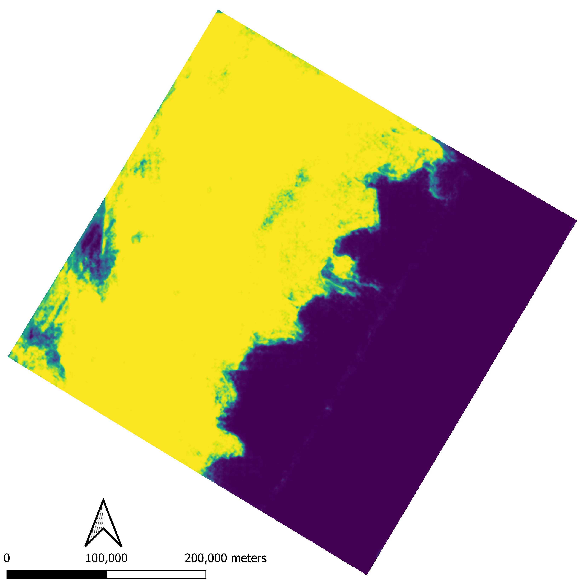

Generate ice or water predictions using models trained with Sentinel-1 images. 

# Getting started
This repository contains three different [Anaconda](https://www.anaconda.com/) environment files:
* [environment.yml](environment.yml) - The working environment with package versions identified. 
* [env_windows_full.yml](env_windows_full.yml) - A full environment exported from a Windows installation. 
* [env_from-history.yml](env_from-history.yml) - A minimum working environment. Package versions are not identified. 

Install the [environment](environment.yml) using the command:  
`conda env create -f environment.yml`

Installing the [environment.yml](environment.yml) might take some time while Anaconda checks for conflicts. The other enviroment files might be helpful in case the installation cannot be completed. 

Activate the environment to use the program:  
`conda activate sea-ice-prediction`

# Using the program
All the Python code necessary to read the models and raster files and output the predictions is contained in [main.py](main.py). The program expects one argument `-c` with the path to a configuration file. The default value for `-c` is [config.cfg](config.cfg). Users might control program behavior by changing the options in [config.cfg](config.cfg)

## Configuration file
[config.cfg](config.cfg) is a [configuration file](https://docs.python.org/3/library/configparser.html) that contains sections and parameters. [config.cfg](config.cfg) contains a single section `io` and the following parameters:
* `dir_out` - Path to output directory. The program creates the directory in case it does not exist. All rasters are written onto this directory.
* `model_path` - Path to [TorchScripts](https://pytorch.org/docs/stable/jit.html) trained models. The program accepts one or more models separated by breaklines for different models. When multiple models are provided, the ice probability is computed as the mean probability for multiple realizations. 
* `input_rasters` - Path to input rasters. The program accepts one or more input rasters, separated by breaklines for different files. The program expects raster files with three bands.
* `device` - PyTorch device. `cpu`, `cuda`, or `cuda:0`, etc are valid options. 

The program writes the resulting predictions on raster files that use the input raster as template:
* `mean-prob-[inputname]` - Raster with two bands, the first one identifying water probability and the second showing ice probability. This output is the mean average of the ensemble of models when multiple models are provided in [config.cfg](config.cfg).
* `class-[inputname]` - Raster with a single band containing `0` for pixels classified as water and `1` for pixels identified as ice. Argmax of `mean-prob-[inputname]`.
* `pred-std-[inputname]` - Raster with two bands, the first band identifies the standard deviation of water  predictions (std of ensemble predictions), and the second band idenfies the standard deviation of ice predictions. Only available when multiple models are provided in [config.cfg](config.cfg). 

# Assumptions 
This program was created to generate outputs for models trained with the ready-to-train [AI4Arctic Sea Ice Challenge Dataset](https://data.dtu.dk/collections/AI4Arctic_Sea_Ice_Challenge_Dataset/6244065), therefore ideally the input rasters should have similar processing. This includes pixel size of 80 m by 80 m. Currently the preprocessing stage is hardcoded, and models expect a three band input (HH, HV, incidence angle). Mean and standard deviations required for normalizations are the ones listed in the [AI4ArcticSeaIceChallenge github repository](https://github.com/astokholm/AI4ArcticSeaIceChallenge/tree/main/misc). 

# Example
The image below is an RGB (HH, HV, incidence angle) composition of a Sentinel-1 image identified in [ExtremeEarth Polar Use Case Training Data](https://zenodo.org/record/4683174#.ZErLXM7MJD8) for the January example. The HH and HV channels are in decibels. 

An ensemble of two models trained with the ready-to-train [AI4Arctic Sea Ice Challenge Dataset](https://data.dtu.dk/collections/AI4Arctic_Sea_Ice_Challenge_Dataset/6244065) processes the image above and produces the ice probabililty below (yellow is one, blue is zero).

# Model examples 
Please reach out to karimzadeh@colorado.edu if you would like access to trained models.